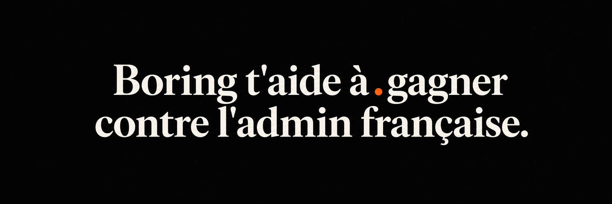
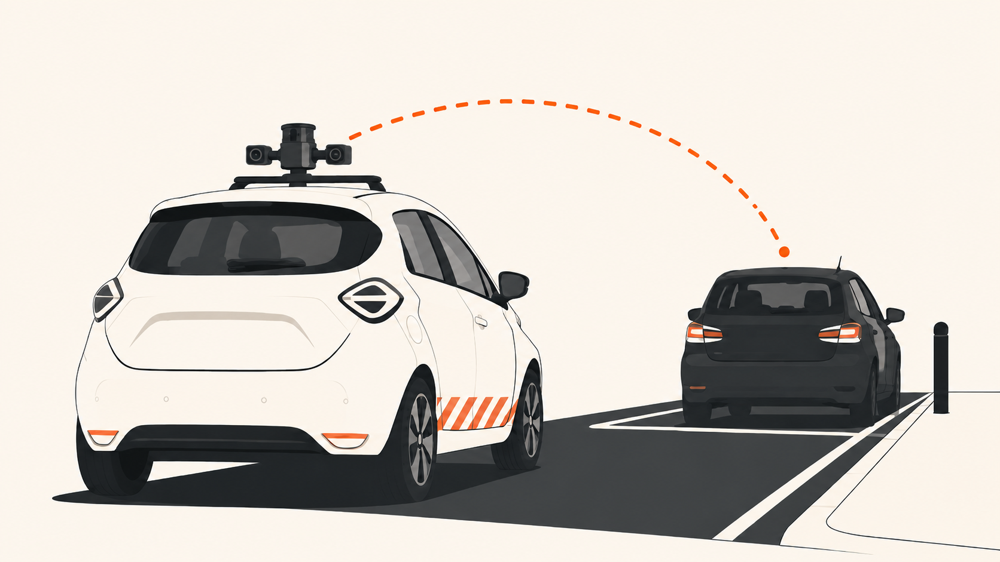
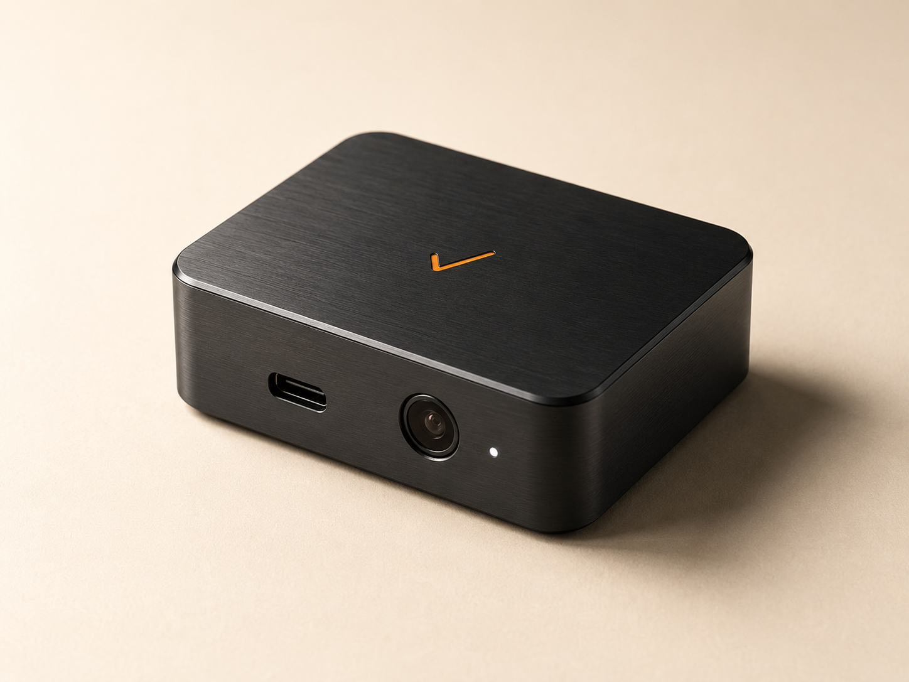
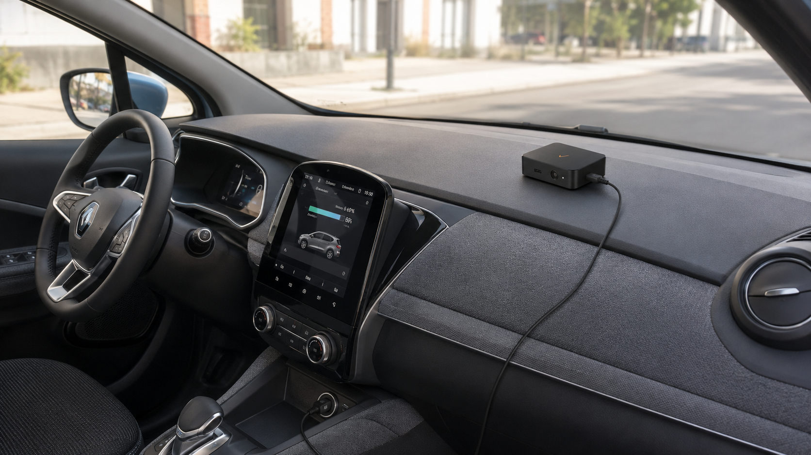
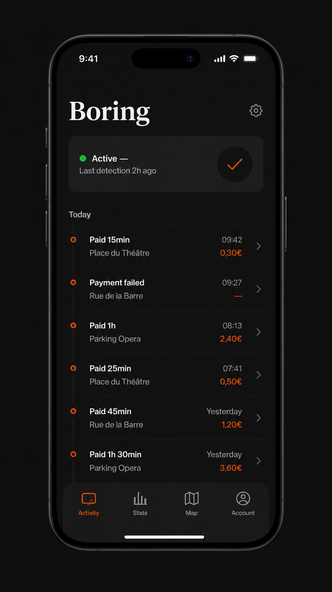

<p align="center">
  
</p>

<p align="center">
  
</p>

<h1 align="center">Boring · <code>Chiant</code></h1>

<p align="center">
  <strong>Plateforme d'assistance, d'aide et de défense administrative pour particuliers français.</strong><br>
  Premier produit : un boîtier qui détecte les véhicules de contrôle et paie ton stationnement.
</p>

<p align="center">
  <em>Le repo est public sous le codename <code>Chiant</code> jusqu'au dépôt INPI de la marque Boring.</em>
</p>

<p align="center">
  <a href="https://github.com/Caezarr/Chiant/actions/workflows/ci.yml"></a>
  <a href="LICENSE"></a>
  
  
  
</p>

---

## Le problème

<p align="center">
  
</p>

Tu te gares 4 fois par semaine pour aller chez un client, voir tes parents, faire une course rapide. Une de ces fois tu oublies de recharger l'horodateur. La voiture-radar passe. **35€.** Multiplé par dix par an, ce sont 400€ d'amendes administratives évitables.

Selon le régulateur néerlandais, **500 000 amendes injustifiées par an** sont émises par ces systèmes LAPI. Et à Paris, 75% de hausse des FPS en un an depuis l'arrivée des voitures-radars.

> *Tu te gares. On paye. Tu oublies.*

---

## La solution

<p align="center">
  
</p>

1. **Détection visuelle** — Une caméra discrète tourne en arrière-plan. Un modèle YOLOv8 reconnaît les véhicules de contrôle automatisé à 30 mètres.
2. **Décision intelligente** — Géofence + cooldown. On vérifie que ta voiture est en zone payante et qu'on n'a pas déjà payé dans les 10 dernières minutes.
3. **Paiement programmatique** — 15 minutes payées via l'API du provider (PayByPhone, EasyPark, OPnGO). **Le minimum légal, jamais plus.**

Tout est piloté par `boring.glue.process_trigger()` ([source](src/boring/glue.py)). Détails techniques dans [ARCHITECTURE.md](ARCHITECTURE.md).

---

## Boring Parking Box

<p align="center">
  
</p>

Boîtier hardware pré-flashé, livré chez toi. Tu branches dans l'allume-cigare, l'app marche, c'est fini. Multi-véhicules, multi-villes (Lille first), modèle scan_car mis à jour OTA.

<table>
  <tr>
    <td><strong>Boring Parking Box</strong><br>Hardware + app + 1 mois Care</td>
    <td align="right"><strong>299€</strong> one-shot</td>
  </tr>
  <tr>
    <td><strong>Boring Care</strong><br>Mises à jour, multi-véhicules, support, garantie</td>
    <td align="right"><strong>9€</strong>/mois</td>
  </tr>
</table>

<p align="center">
  
</p>

### 🛡 Garantie Zéro FPS

> **Tu reçois un FPS pendant que Boring tourne ? On te le rembourse.**

Pas de petits caractères. Si l'app est active et que ta voiture est garée en zone payante, et que tu prends quand même un FPS — on rembourse l'amende. Jusqu'à 4 FPS remboursés par an, conditions [CGU complètes](docs/parking.html#garantie).

Et **30 jours satisfait ou remboursé** sur le hardware. Pas de questions pièges.

<p align="center">
  
</p>

---

## Quick start (dev)

```bash
git clone https://github.com/Caezarr/Chiant.git
cd Chiant
cp .env.example .env          # → renseigne ASSISTED_IMESSAGE_RECIPIENT au minimum
make dev                      # uv sync + outils dev
make test                     # 205 tests doivent passer
make zones                    # télécharge / met à jour les zones Lille
make scrape-baseline          # images web candidates control_vehicle
make scrape-negatives         # hard negatives gratuits
make import-openimages        # hard negatives Open Images depuis CSV locaux
make vision-sources           # catalogue sources gratuites candidates
make vision-ready             # audit dataset/modele + revue licence
uv run boring vision-ready --allow-unreviewed-sources  # rehearsal dataset candidat
uv run boring vision-eval --dataset datasets/control_vehicle_v1 --model models/best.pt --split valid --frame-interval 1
uv run boring vision-benchmark --model models/best.pt --frames 120 --min-fps 2.0
make autopay-ready            # audit env/HAR avant paiement reel
uv run boring autopay-smoke --yes --output reports/autopay-smoke.json
uv run boring box-doctor      # preflight config boîtier headless
cp deploy/pi/hardware-profile.example.json deploy/pi/hardware-profile.json
uv run boring box-burn-in --minutes 120 --interval 60    # preuve terrain Pi
uv run boring box-notify-test --output reports/notification-test.json
uv run boring box-ready --hardware-profile deploy/pi/hardware-profile.json --vision-eval-report reports/vision-eval.json --benchmark-report reports/vision-benchmark.json --autopay-smoke-report reports/autopay-smoke.json --notification-report reports/notification-test.json --burn-in-report burn-in/report.json
uv run boring box-evidence-pack --output reports/evidence-pack.json
uv run boring contest-fps --subject "FPS-X" --reason "Test"  # smoke test contestation
```

Pour `box-ready` en mode prod, lance aussi `autopay-smoke` avec `PAYMENT_DRY_RUN=false`, configure `NETWORK_RECOVERY_COMMAND`, `BORING_NOTIFY_WEBHOOK_URL` ou `NTFY_WEBHOOK_URL`, puis lance `box-notify-test`; sans preuve d'autopaiement reel minimal, recovery reseau et notification 2xx, le boitier n'est pas installable.

Si tu veux contribuer ou build ton propre boîtier : lis [HUMAN-TODO.md](HUMAN-TODO.md) pour les étapes humaines (captation Lille, annotation, training, reverse PayByPhone via HAR).
Architecture boîtier : [docs/BOX.md](docs/BOX.md). Déploiement Pi : [deploy/pi/README.md](deploy/pi/README.md). Dataset vision : [docs/DATASETS.md](docs/DATASETS.md). Autopaiement : [docs/AUTOPAYMENT.md](docs/AUTOPAYMENT.md).

---

## Statut

**Pre-alpha**. Pas pour usage réel pour l'instant.

### Ce qui marche ✅
- Pipeline détection live YOLOv8 + tracker anti-faux-positif (baseline COCO `car`)
- Geofence Lille fonctionnelle (fallback bounding box centre-ville)
- Mode paiement `assisted` via iMessage (rappel intelligent → tu valides en 1 tap)
- Multi-provider scaffolding : PayByPhone (réel), EasyPark / Flowbird / OPnGO (stubs)
- Vertical 2 — **`boring.contest`** : génération RAPO automatique + escalade CCSP
- CLI complète : `capture / detect / run / pay-now / contest-fps`
- Runtime headless boîtier : `box-run / box-doctor`, config Pi 4 / Pi 5 documentée
- Tests pytest (205/205), CI GitHub Actions, pre-commit hooks

### Ce qui manque ⏳
- Modèle custom `control_vehicle` (besoin captation terrain — cf. HUMAN-TODO #1-3)
- Reverse PayByPhone validé (besoin HAR — cf. HUMAN-TODO #4)
- Clients EasyPark / Flowbird / OPnGO implémentés
- Vraies zones Lille (API MEL en migration côté serveur)
- LRAR digitale réelle pour Boring Contest (AR24 ou Maileva)

---

## Architecture (en 1 paragraphe)

`boring.cli` parse les commandes → `boring.glue` orchestre → `boring.detect` (YOLO) émet des triggers → `boring.geofence` (Shapely) filtre par zone → `boring.glue.process_trigger` appelle `boring.payment.<provider>` → `boring.notify` envoie une notif macOS. Tout est testable indépendamment, le tout dans 33 modules.

Pour les détails : [ARCHITECTURE.md](ARCHITECTURE.md).

```
[ Webcam ] → [ YOLOv8 detect ] → [ StreamTracker ]
                                       ↓ (3 frames consécutives)
                                  [ Geofence ]
                                       ↓ (en zone payante ?)
                                  [ Cooldown ]
                                       ↓ (pas payé dans les 10 min ?)
                                  [ PayByPhone / EasyPark / OPnGO ]
                                       ↓
                                  [ Notif macOS ]
```

---

## Modes de paiement

| Mode | Risque légal | Latence | Friction user | Dispo |
|---|---|---|---|---|
| `assisted` | Nul | ~4 s | 1 tap iPhone | ✅ |
| `auto` | Zone grise | < 1 s | Aucune | ⏳ HAR PayByPhone |

Toggle via `PAYMENT_MODE=assisted\|auto` dans `.env`.

---

## Multi-provider

Le `PROVIDER_REGISTRY` permet de basculer le client API au runtime :

```bash
PAYMENT_PROVIDER=paybyphone   # défaut (impl. la plus avancée)
PAYMENT_PROVIDER=easypark     # stub
PAYMENT_PROVIDER=flowbird     # stub
PAYMENT_PROVIDER=opngo        # stub
```

Tous implémentent `PaymentProvider` (interface dans [`src/boring/payment/base.py`](src/boring/payment/base.py)). Le même pattern s'applique au vertical Contest : `CONTEST_REGISTRY` mappe les providers (`rapo`, à venir `ccsp`, `caf`, `france_travail`).

---

## Roadmap multi-vertical

<p align="center">
  
</p>

Boring n'est pas qu'un produit parking. C'est une plateforme d'assistance/défense administrative. **Parking est le cheval de Troie viral**, les autres verticaux sont la fin.

| Vertical | Cible | Modèle | Statut |
|---|---|---|---|
| **Parking** (v0.1) | Eviter les FPS | Boîtier 299€ + Care 9€/mois + garantie | 🚧 En build |
| **Contest FPS** (v0.3) | Contestation RAPO/CCSP auto | 19€/contestation ou 30% no-win-no-fee | 🚧 Module scaffolded |
| **Indemnités** (v0.5) | Récup G30 SNCF + CE261 + abos zombie | 25% no-win-no-fee | 📋 Planifié |
| **CAF** (v0.7) | Contester indus + refus aides | 29€ + 15% du gain | 📋 Planifié |
| **Conso** (v0.8) | Litige vice caché / garantie / SAV | 19€ LRAR ou 20% récup | 📋 Planifié |
| **Locataire** (v0.9) | Caution non rendue + loyer abusif | 29€ ou 15% récup | 📋 Planifié |

Logique d'enchaînement : Parking → Contest (cross-sell same user) → Indemnités (effet viral récup cash) → CAF (légitimité défense citoyenne) → Conso → Locataire.

---

## Modèle dual : OSS + Premium

**Pour chaque vertical Boring, deux versions :**

| | OSS (gratuit) | Premium (clé en main) |
|---|---|---|
| Tu reçois | Code + templates + guides | Service exécuté pour toi + garantie |
| Travail | 1-2 weekends, ~150€ hardware (Parking) | 0 friction, paiement direct |
| Pour qui | Bricoleurs, devs, curieux | Tout le monde d'autre |
| Garantie | Tu te débrouilles | **Risk-reversal absolu** (cf. Parking) |

L'OSS sert deux objectifs : acquisition virale (preuve de sérieux) + défense légale (intention documentée).
Le Premium capture la valeur avec la garantie qui démolit l'objection conversion.

---

## Différenciation vs prior art

[Haloban Lab](https://www.tiktok.com/@halobanprod) (Paris, Wesley + Victor) a démontré en mai 2026 un système équivalent (Pi + 2 webcams + YOLO baseline). Edge de Boring :

1. **Modèle custom `control_vehicle`** (eux : YOLO COCO `car` générique → trigger sur toute voiture)
2. **Lille first** (eux : Paris-only)
3. **Boîtier hardware vendu pré-flashé** avec garantie zéro FPS (eux : DIY)
4. **Framing légalement défendable** : "outil de paiement optimisé", pas "ANTI PV"
5. **Multi-provider + multi-vertical** : PayByPhone + EasyPark + OPnGO + Flowbird, + 5 autres verticaux planifiés

---

## Contribuer

- **Issues** : templates dans [`.github/ISSUE_TEMPLATE/`](.github/ISSUE_TEMPLATE/)
- **PRs** : checklist dans [`.github/pull_request_template.md`](.github/pull_request_template.md)
- **Setup dev** : `make dev && pre-commit install`
- **Tests** : `make test` — doit passer (42/42 actuellement) avant tout commit

---

## Sécurité

Vulnérabilités : voir [SECURITY.md](SECURITY.md). En court : `gabriel@meetwonka.com` avec préfixe `[SECURITY]`.

---

## Licence

Code sous [Apache 2.0](LICENSE). La marque commerciale **Boring** est réservée à Caezarr / Gabriel ; en attendant le dépôt INPI, le repo public est sous le codename `Chiant`.

---

## Avertissement juridique

L'objectif explicite de Boring est de **faciliter le paiement du stationnement**, pas de l'éviter. Le minimum payé est toujours > 0.

Précédent à ne pas reproduire : [Parkeerwekker (NL)](https://blog.iusmentis.com/2022/06/02/oh-ja-dat-parkeerwekker-bestond-dus-nog-maar-in-hoger-beroep-niet-meer/) interdit en appel 2022 pour framing "anti-contrôle". Boring ne fait pas ça.

---

<p align="center">
  <em>Marre des emmerdes admin françaises ? Nous aussi.</em><br>
  <strong>Rejoins la waitlist Boring Parking Box →</strong>
  <a href="https://caezarr.github.io/Chiant/#waitlist">caezarr.github.io/Chiant</a>
</p>
